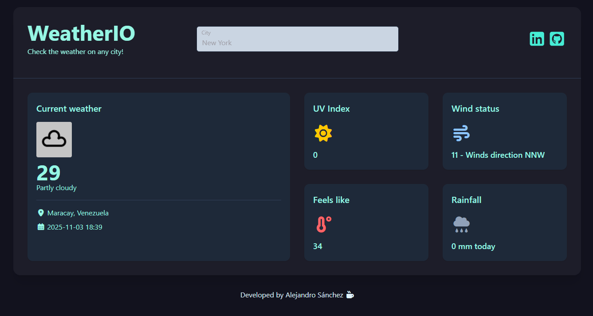

# Weatherio

This project was generated using [Angular CLI](https://github.com/angular/angular-cli) version 19.2.4.

## About the project

Weatherio it's a practice project that retreives data from a public weather API. In this application you can check the current weather in any city in the world just by prompting the city, lattitude or just by hitting the button 'check my current weather'.

## Built with

This project was build with **Angular 19, PrimeNG, Tailwind CSS and TypeScript.**
